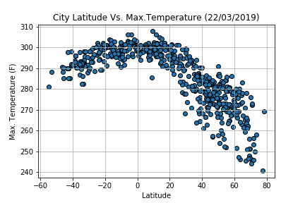
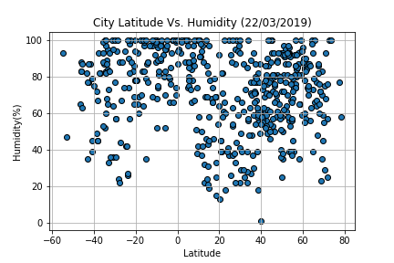
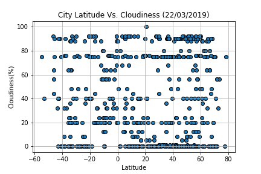
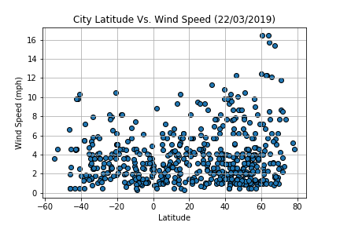

# Introduction

This project visualizes worldwide weather patterns based on geo coordinates.

# Overview of the Data

Using open WeatherMap API, retrieved data that had max temperature, humidity, cloudiness and windspeed information for a list of over 500 cities. \

## Limitations of the Data

Several iterations of the calls resulted in extreme outliers which upon closer inspection were not correct at the time the call was made. For example, one instance listed Parrita, Costa Rica as having a wind speed of 122 mph when the actual wind speed at the time was 7 mph. This is most likely a glitch existing on the open weather app. The x and y limitations of the scatter plots were adjusted to compensate where necessary.

# Methods

The Numpy random function was used to generate a list of coordinates which was run through the citypy library to find the nearest city.

A nested for loop was used to retrieve data from open weather map API and loaded into a pandas DataFrame, while the time module sleep function handled the run time to control for maximum allowable calls from the API.

After some minor formatting of the DataFrame, visualizations were created with matplotlib and gmaps was used to show the locations of the visualized cities.

# Analysis

For the purpose of this analysis, latitude will serve as the independent variable for several weather conditions. This will yield scatter plots that show visually how these weather conditions vary throughout Earth and reveal if there are any visible patterns.

## Latitude vs. Temperature

## Latitude vs. Humidity

## Latitude vs. Cloudiness

## Latitude vs. Wind Speed

# Results of Analysis

Temperatures increase closer to the equator (0 latitude) with a sharp decline around 60 latitude and more disparate temperatures 40-60 latitude.

Cloudiness and humidity do not have any observable trends between different latitudes.

Wind speed also does not have a clear pattern based on latitude, though it appears that the highest speeds are at the farthest south and farthest north. While this phenomenon is observed through several iterations, it is not necessarily experienced every time the data is pulled from the API.

